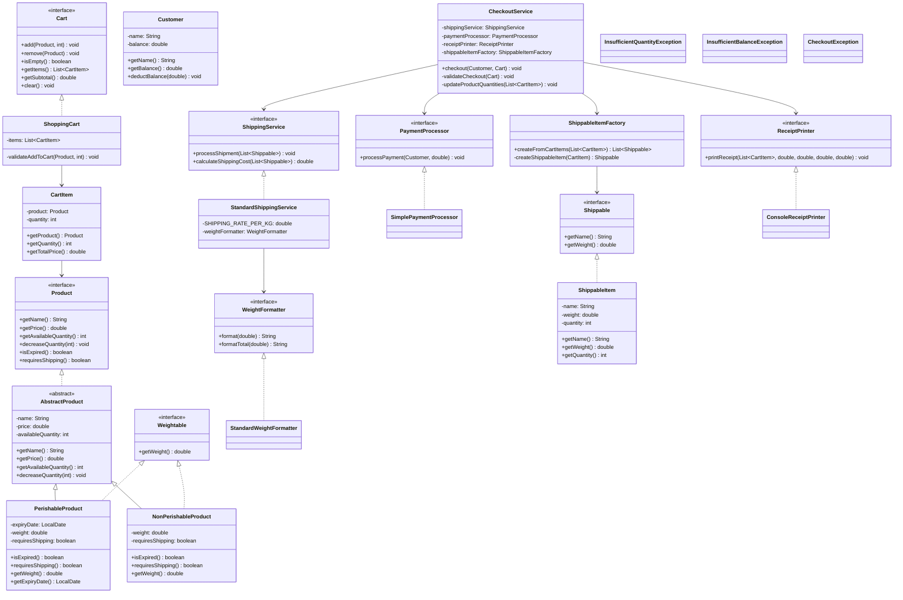
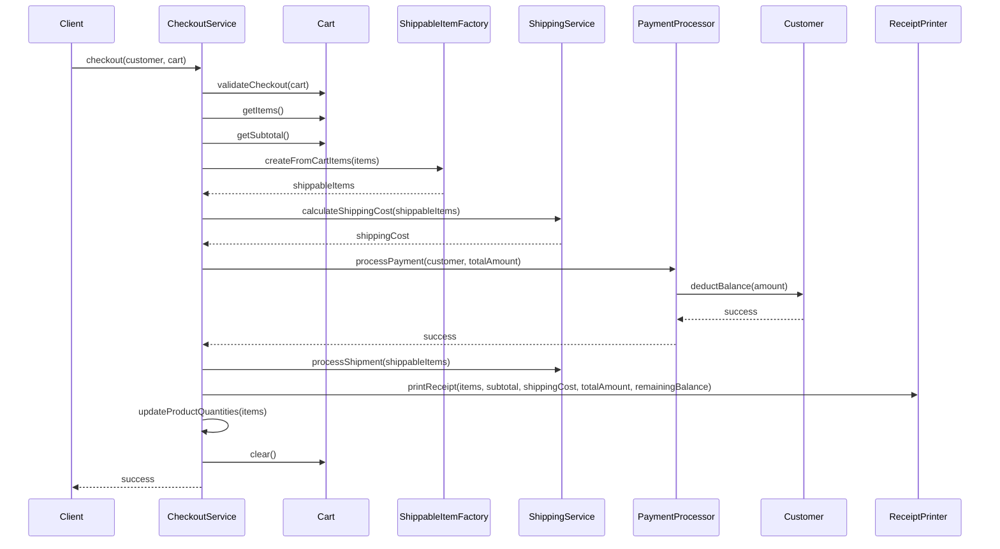

# E-Commerce System

This repository contains a Java-based e-commerce system with support for product management, shopping cart, checkout process, and shipping functionality. The system follows SOLID principles and utilizes object-oriented design patterns.

## System Overview

The e-commerce system allows users to:
- Add various types of products to a shopping cart
- Process checkout operations
- Handle shipping for physical products
- Print receipts for purchases

## Architecture

The system is designed using several core design patterns:
- **Factory Pattern**: For creating shippable items
- **Strategy Pattern**: For payment processing and shipping services 
- **Template Method Pattern**: Using abstract classes to define algorithms with steps that can be redefined by subclasses
- **Composition over Inheritance**: Using interfaces to define behaviors

## Class Diagram



## Component Diagram

```mermaid
flowchart TD
    subgraph Products
        Product[Product Interface]
        AbstractProduct[AbstractProduct]
        PerishableProduct[PerishableProduct]
        NonPerishableProduct[NonPerishableProduct]
        Weightable[Weightable Interface]
    end
    
    subgraph ShoppingCart
        Cart[Cart Interface]
        ShoppingCart[ShoppingCart]
        CartItem[CartItem]
    end
    
    subgraph Checkout
        CheckoutService[CheckoutService]
        PaymentProcessor[PaymentProcessor Interface]
        SimplePaymentProcessor[SimplePaymentProcessor]
        Customer[Customer]
    end
    
    subgraph Shipping
        ShippingService[ShippingService Interface]
        StandardShippingService[StandardShippingService]
        Shippable[Shippable Interface]
        ShippableItem[ShippableItem]
        ShippableItemFactory[ShippableItemFactory]
        WeightFormatter[WeightFormatter Interface]
        StandardWeightFormatter[StandardWeightFormatter]
    end
    
    subgraph Receipt
        ReceiptPrinter[ReceiptPrinter Interface]
        ConsoleReceiptPrinter[ConsoleReceiptPrinter]
    end
    
    %% Relationships
    Product --> AbstractProduct
    AbstractProduct --> PerishableProduct
    AbstractProduct --> NonPerishableProduct
    PerishableProduct --> Weightable
    NonPerishableProduct --> Weightable
    
    Cart --> ShoppingCart
    ShoppingCart --> CartItem
    CartItem --> Product
    
    CheckoutService --> Cart
    CheckoutService --> ShippingService
    CheckoutService --> PaymentProcessor
    CheckoutService --> ReceiptPrinter
    CheckoutService --> ShippableItemFactory
    PaymentProcessor --> SimplePaymentProcessor
    SimplePaymentProcessor --> Customer
    
    ShippingService --> StandardShippingService
    StandardShippingService --> WeightFormatter
    StandardShippingService --> Shippable
    WeightFormatter --> StandardWeightFormatter
    ShippableItemFactory --> Shippable
    ShippableItemFactory --> ShippableItem
    
    ReceiptPrinter --> ConsoleReceiptPrinter
```

## Key Components

### Product Management
- `Product` interface defines the core behavior for all products
- `AbstractProduct` provides a skeletal implementation
- `PerishableProduct` and `NonPerishableProduct` implement specific behaviors

### Shopping Cart
- `Cart` interface defines cart operations
- `ShoppingCart` implements cart operations with validation
- `CartItem` encapsulates product and quantity information

### Checkout Process
- `CheckoutService` orchestrates the checkout process
- `PaymentProcessor` handles payment operations
- `Customer` represents the user with a balance

### Shipping System
- `ShippingService` handles shipping calculations and processing
- `Shippable` defines items that can be shipped
- `ShippableItemFactory` creates shipping items from cart items
- `WeightFormatter` formats weight values for display

### Receipt Generation
- `ReceiptPrinter` defines receipt printing behavior
- `ConsoleReceiptPrinter` outputs receipts to the console

## Usage Example

```java
// Create dependencies
WeightFormatter weightFormatter = new StandardWeightFormatter();
ShippingService shippingService = new StandardShippingService(weightFormatter);
PaymentProcessor paymentProcessor = new SimplePaymentProcessor();
ReceiptPrinter receiptPrinter = new ConsoleReceiptPrinter();
ShippableItemFactory shippableItemFactory = new ShippableItemFactory();

// Create checkout service
CheckoutService checkoutService = new CheckoutService(
    shippingService, paymentProcessor, receiptPrinter, shippableItemFactory
);

// Create products
Product cheese = new PerishableProduct("Cheese", 100, 5, 
        LocalDate.now().plusDays(7), 0.2, true);
Product tv = new NonPerishableProduct("TV", 5000, 3, 20.0, true);

// Create customer
Customer customer = new Customer("John", 10000);

// Create shopping cart and add products
Cart cart = new ShoppingCart();
cart.add(cheese, 2);
cart.add(tv, 1);

// Checkout
try {
    checkoutService.checkout(customer, cart);
} catch (CheckoutException e) {
    System.out.println("Error: " + e.getMessage());
}
```

## Exception Handling

The system uses specific exceptions to handle various error cases:
- `InsufficientQuantityException`: When requested quantity exceeds available quantity
- `InsufficientBalanceException`: When customer balance is insufficient for payment
- `CheckoutException`: Generic checkout errors including expired products and empty carts

## Design Principles Applied

1. **Single Responsibility Principle**: Each class has one responsibility
2. **Open/Closed Principle**: System is open for extension but closed for modification
3. **Liskov Substitution Principle**: Subtypes can be substituted for base types
4. **Interface Segregation Principle**: Clients aren't forced to depend on interfaces they don't use
5. **Dependency Inversion Principle**: High-level modules depend on abstractions

## Sequence Diagram: Checkout Process



## Running the Demo

The `Main` class contains several test cases demonstrating different aspects of the system:
1. Successful checkout with multiple products
2. Error handling for expired products
3. Error handling for insufficient customer balance
4. Error handling for empty cart
5. Example from requirements

To run the demo:
```
java Main
```
